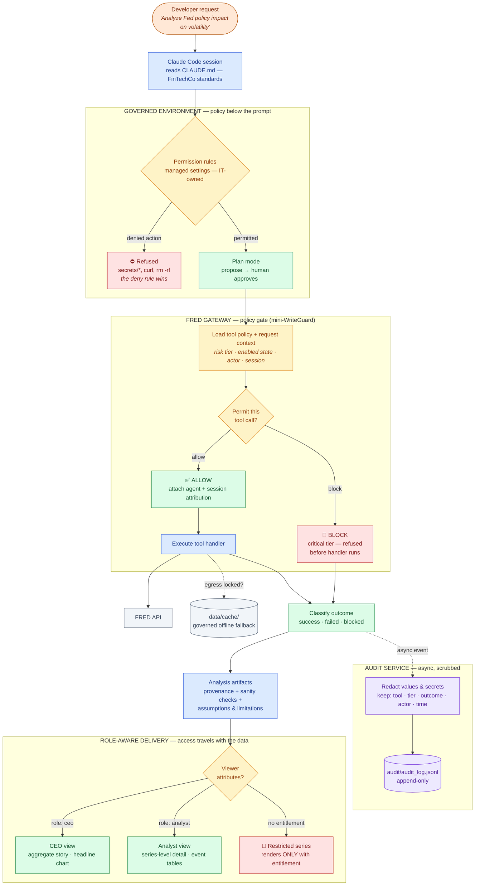

# FinTechCo Quant — Governed Request Flow

*One request, end to end: developer keystroke → governed environment →
policy-gated data access → attributed audit → role-aware delivery.
Zones map to the demo acts (noted at the bottom).*

**Zone → demo act → philosophy:**

| Zone | Demo act | Philosophy verified |
|---|---|---|
| Governed Environment | Act 1 (deny beat) + Act 2 (plan) | 1.1, 1.2, 2.1 |
| FRED Gateway policy gate | Act 3 (governed door) + Act 4b (blocked tier) | 1.3, 3.1, 3.2 |
| Audit Service | Act 4 (`cat` the trail) | 3.2, 3.3 |
| Role-Aware Delivery | Act 5 (two screens finale) | 4.1, 4.2, 4.3 |

*The read of the diagram, spoken in one breath: "every request passes
two policy gates before touching data, every action lands attributed in
an append-only trail, and the deliverable itself renders through
entitlement — governance from keystroke to dashboard."*