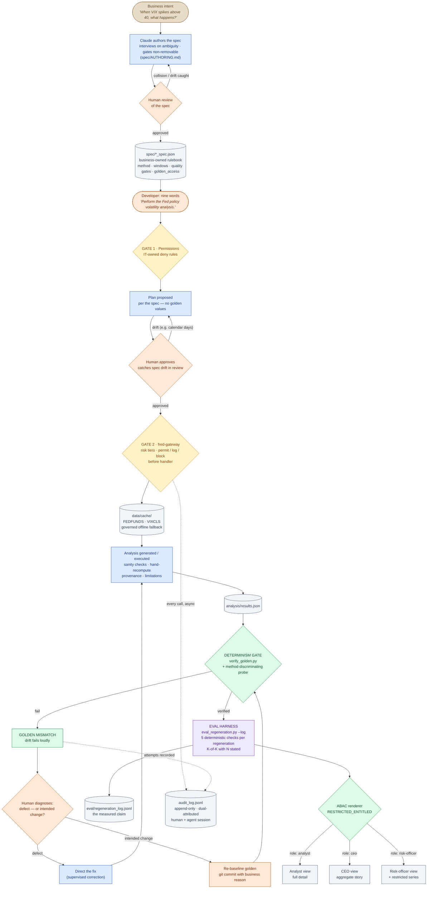

# FinTechCo Quant — The Complete Workflow

*Two views of the same system. Diagram 1: the process from business
intent to entitled delivery, eval harness included. Diagram 2: the
same workflow on a clock — one business day, 9:35 AM to 4:00 PM,
including the mid-day rule change.*

**Color legend (both diagrams):**

| Color | Actor / layer |
|---|---|
| 🟤 Tan | **Business** — owns intent and the rulebook |
| 🔵 Blue | **Claude / agent** — language and generation work |
| 🟠 Orange | **Human decision** — review, approval, re-baseline |
| 🟡 Amber | **Policy gates** — permissions + tool gateway |
| 🟢 Green | **Deterministic system** — checks, gates, arithmetic |
| 🟣 Purple | **Eval harness** — measurement across runs |
| ⚪ Gray | **Data & artifacts** at rest |

---

## 1 · End-to-end process flow (with the eval harness)

**The read, one breath:** *business intent becomes a Claude-authored,
human-reviewed rulebook; nine words trigger governed generation
through two policy gates; a determinism gate certifies the numbers
and the eval harness measures the rate across regenerations; and the
deliverable renders through entitlement — with every action
attributed in an append-only trail.*

---

## 2 · One business day — 9:35 AM → 4:00 PM

```mermaid
flowchart LR
    classDef biz fill:#e8dcc8,stroke:#8a6d3b,color:#5c4a28
    classDef agent fill:#dbeafe,stroke:#1d4ed8,color:#1e3a8a
    classDef human fill:#ffe8d6,stroke:#b45309,color:#7c2d12
    classDef det fill:#dcfce7,stroke:#15803d,color:#14532d
    classDef evals fill:#ede9fe,stroke:#6d28d9,color:#4c1d95
    classDef data fill:#f1f5f9,stroke:#475569,color:#334155

    subgraph MORNING["MORNING — the urgent question"]
        direction LR
        T1["9:35<br/>Strategist asks:<br/>Fed policy → volatility,<br/>needed by 2 PM"]:::biz
        T2["9:40<br/>Developer: nine words<br/>plan proposed per spec"]:::agent
        T3["9:45<br/>Human approves plan<br/>(drift check in review)"]:::human
        T4["9:50<br/>Governed execution:<br/>gateway → analysis →<br/>sanity checks"]:::agent
        T5["10:05<br/>GOLDEN VERIFIED<br/>8 values · eval logged"]:::det
        T6["10:15<br/>Three role renders<br/>delivered: analyst ·<br/>CEO · risk-officer"]:::data
        T7["10:30<br/>Findings readout:<br/>null result + confound<br/>honestly stated"]:::biz
    end

    subgraph AFTERNOON["AFTERNOON — change is constant"]
        direction LR
        T8["2:30<br/>Risk committee:<br/>threshold 25 → 50 bps"]:::biz
        T9["2:40<br/>Business edits ONE<br/>field in the spec<br/>(git-reviewable diff)"]:::human
        T10["2:50<br/>Regeneration<br/>per updated spec"]:::agent
        T11["3:05<br/>GOLDEN MISMATCH<br/>gate fires — drift<br/>cannot ship silently"]:::det
        T12["3:15<br/>Human re-baselines:<br/>git commit with the<br/>business reason"]:::human
        T13["3:30<br/>Re-verified · eval<br/>logged (K grows)"]:::evals
        T14["4:00<br/>Updated certified<br/>analysis delivered —<br/>audit trail complete"]:::data
    end

    T1-->T2-->T3-->T4-->T5-->T6-->T7
    T7 -.-> T8
    T8-->T9-->T10-->T11-->T12-->T13-->T14
```

**The two sentences this timeline proves:** the morning proves
*velocity under governance* — question at 9:35, certified and
entitlement-rendered answer before 10:30, deadline beaten by hours.
The afternoon proves *fluidity with zero tolerance* — a business rule
changes at 2:30, the spec absorbs it as a one-line diff, the gate
refuses silent drift, a human signs the re-baseline, and the updated
certified answer ships by 4:00. One day, both halves of the thesis.